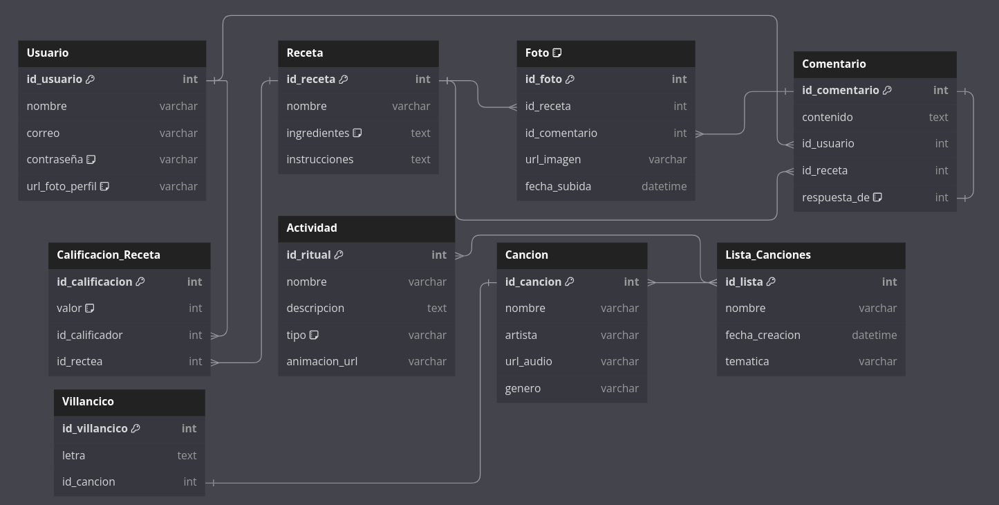

## PARRANDA NAVIDEÑA

#### **Producto**

Diseñar y desarrollar una plataforma digital que encapsule la magia de la Navidad, brindando a los usuarios una experiencia inmersiva que les permita conectarse con las tradiciones, la música, las recetas, y las actividades típicas de la temporada decembrina de una manera interactiva y entretenida.

#### **Descripción**

La aplicación tiene como objetivo convertirse en el punto de encuentro digital para celebrar las festividades navideñas y de Año Nuevo. Ofrecerá una amplia variedad de funcionalidades, desde novenas virtuales animadas y recetas tradicionales colombianas, hasta actividades interactivas como rituales y música. Este ecosistema digital está diseñado para fomentar la unión entre las personas, fortalecer las tradiciones y disfrutar la esencia de la Navidad desde cualquier dispositivo.

----------

## **Requerimientos Funcionales**

#### **1. Autenticación y Gestión de Usuarios**

1.1. **Registro de usuarios**:

-   Los usuarios deben poder registrarse proporcionando nombre, correo electrónico y contraseña. 

1.2. **Inicio de sesión**:

-   Autenticación segura mediante usuario y contraseña. 

1.3. **Recuperación de contraseña**:

-   Funcionalidad para recuperación de acceso a través del correo registrado. 

1.4. **Gestión de perfil**:

-   Posibilidad de editar información personal (nombre, correo, foto de perfil).
-   Cambio de contraseña mediante verificación.

#### **2. Experiencia Interactiva**

2.1. **Eventos principales**:

-   Interfaz central donde se muestran las actividades destacadas de la temporada.
-   Posibilidad de seleccionar entre diversas actividades.

#### **3. Actividades**

**3.1. Novenas Virtuales**:

-   Animaciones inmersivas para simular novenas tradicionales.
-   Acceso a lecturas de oraciones y reproducción automática de villancicos.

**3.2. Rituales Navideños**:

-   Visualizar el ritual explicativo de las doce uvas para comprender las tradiciones de Año Nuevo.
-   Visualizar la quema del Año Viejo virtualmente con animaciones para recrear la tradición.
-   Visualizar el ritual de prender velas para simbolizar la tradición navideña.

**3.3. Radio Navideña**:

-   Espacio para reproducir listas de canciones típicas de diciembre en Colombia.
-   El usuario podrá seleccionar 2 tipos de reproduccion de la música: lista continua y modo radio:
  - La reproduccion de modo radio seleccionará  musica de manera aleatoria de diferentes listas, permitiendo a los usuarios disfrutar de variedad.
-   Inclusión de efectos visuales festivos.

**3.4. Recetas Colombianas**:

-   Plataforma para visualizar recetas navideñas.
-   Estas recetas son publicadas en "posts". Cada post tiene instrucciones paso a paso así como imagenes del plato ya preparado.
-   Posibilidad de comentar y calificar recetas propuestas en la aplicación.
-   Espacio para subir fotos de las preparaciones de los usuarios e interactuar entre ellos por medio de comentarios.

----------
## **Requerimientos No Funcionales**

1.  **Multidispositivo**:
    -   Compatibilidad con dispositivos móviles, tablets y desktops.
2.  **Interactividad**:
    -   Animaciones suaves para actividades visuales (e.g., prender velas, quema del Año Viejo).
3.  **Rendimiento**:
    -   Optimización para la carga rápida de contenido multimedia.
4.  **Seguridad**:
    -   Protección de datos de usuario mediante cifrado y prácticas seguras de desarrollo.

----------

## Historias de Usuario 

| **NOMBRE**                       | CU01 - Registro de usuario |  
|----------------------------------|---------------------------|                              
| **USUARIO**                      | Visitante de la plataforma |
| **DESCRIPCIÓN**                  | Como usuario, puedo registrarme proporcionando mi nombre, correo electrónico y contraseña para acceder a las funcionalidades de la aplicación. |
| **YO COMO**                      | Visitante de la plataforma que desea unirme a la comunidad navideña. |
| **NECESITO**                     | Registrarme proporcionando mis datos personales de forma segura. |
| **PARA**                         | Acceder a todas las funcionalidades de la plataforma. |
| **RELACIÓN CON OTRAS HISTORIAS** | Previa al inicio de sesión. |
| **PRECONDICIONES**               | - El visitante debe tener acceso a internet y un dispositivo compatible.   - El correo proporcionado debe ser válido. |
| **CRITERIOS DE ACEPTACIÓN**      | 1. El sistema permite ingresar nombre, correo y contraseña.   2. El correo debe ser único y validado en formato.   3. Se envía un mensaje de confirmación tras completar el registro. |
| **DEFINICIÓN DE HECHO (DoD)**    | 1. El usuario puede registrarse correctamente.   2. Los datos se almacenan con seguridad en la base de datos. |
| **NOTAS ADICIONALES**            | - El usuario debe:     1. Acceder a la página de registro desde el botón de "Registrarse".     2. Completar los campos obligatorios (nombre, correo y contraseña).     3. Confirmar el registro presionando el botón "Crear cuenta".     4. Recibir un mensaje de éxito indicando que su registro ha sido completado.     5. Confirmar su correo electrónico a través de un enlace enviado al correo proporcionado. |

---

| **NOMBRE**                       | CU02 - Inicio de sesión |  
|----------------------------------|---------------------------|  
| **USUARIO**                      | Usuario registrado |
| **DESCRIPCIÓN**                  | Como usuario, puedo iniciar sesión con mi correo electrónico y contraseña para acceder a mi perfil. |
| **YO COMO**                      | Usuario registrado que desea ingresar a la plataforma. |
| **NECESITO**                     | Iniciar sesión de manera segura usando mis credenciales. |
| **PARA**                         | Acceder a mi perfil y participar en las actividades. |
| **RELACIÓN CON OTRAS HISTORIAS** | Depende de "Registro de usuario". |
| **PRECONDICIONES**               | - El usuario debe estar registrado y recordar sus credenciales. |
| **CRITERIOS DE ACEPTACIÓN**      | 1. Validación correcta de correo y contraseña.   2. Mensaje de error claro en caso de credenciales incorrectas.   3. Implementación de límite de intentos para prevenir ataques de fuerza bruta. |
| **DEFINICIÓN DE HECHO (DoD)**    | 1. La sesión se inicia correctamente y permanece activa hasta su cierre.   2. Las contraseñas están cifradas en la base de datos. |
| **NOTAS ADICIONALES**            | - El usuario debe:     1. Acceder a la página de inicio de sesión desde el botón "Iniciar sesión".     2. Ingresar su correo y contraseña en los campos correspondientes.     3. Presionar el botón "Ingresar".     4. Ser redirigido a la página principal de la plataforma si las credenciales son correctas.|

---

| **NOMBRE**                       | CU03 - Recuperación de contraseña |  
|----------------------------------|---------------------------------------------|
| **USUARIO**                      | Usuario registrado que olvidó su contraseña |
| **DESCRIPCIÓN**                  | Como usuario, puedo recuperar mi contraseña a través de un enlace enviado a mi correo electrónico para restablecer el acceso a mi cuenta. |
| **YO COMO**                      | Usuario que no puede acceder a mi cuenta. |
| **NECESITO**                     | Solicitar un enlace de recuperación y establecer una nueva contraseña. |
| **PARA**                         | Restaurar mi acceso a la plataforma. |
| **RELACIÓN CON OTRAS HISTORIAS** | Depende de "Inicio de sesión". |
| **PRECONDICIONES**               | - El correo registrado debe ser válido y accesible. |
| **CRITERIOS DE ACEPTACIÓN**      | 1. El sistema envía un enlace único de recuperación al correo del usuario.   2. El enlace expira después de un periodo definido (30 minutos).   3. El usuario puede establecer una nueva contraseña tras acceder al enlace. |
| **DEFINICIÓN DE HECHO (DoD)**    | 1. El correo de recuperación llega correctamente.   2. El usuario puede establecer una nueva contraseña y acceder a su cuenta. |
| **NOTAS ADICIONALES**            | - El usuario debe:     1. Acceder a la opción "¿Olvidaste tu contraseña?" desde la pantalla de inicio de sesión.     2. Ingresar su correo electrónico registrado.     3. Recibir un correo con un enlace para restablecer la contraseña.     4. Seguir el enlace y establecer una nueva contraseña, cumpliendo con los requisitos de seguridad.     5. Confirmar el cambio y acceder nuevamente a la plataforma con su nueva contraseña. |

---

| **NOMBRE**                       | CU04 - Gestión de perfil | 
|----------------------------------|----------------------|
| **USUARIO**                      | Usuario autenticado |
| **DESCRIPCIÓN**                  | Como usuario, puedo editar mi información personal (nombre, foto de perfil) para mantener mi cuenta actualizada. También puedo cambiar mi contraseña con un proceso de verificación para garantizar la seguridad de mi cuenta. |
| **YO COMO**                      | Usuario registrado que desea actualizar mis datos. |
| **NECESITO**                     | Modificar mi nombre, foto de perfil y contraseña. |
| **PARA**                         | Mantener mi información actualizada y segura. |
| **RELACIÓN CON OTRAS HISTORIAS** | Depende de "Inicio de sesión". |
| **PRECONDICIONES**               | - El usuario debe estar autenticado. |
| **CRITERIOS DE ACEPTACIÓN**      | 1. El sistema permite modificar datos personales y guardar los cambios. |
| **DEFINICIÓN DE HECHO (DoD)**    | 1. Los datos editados se actualizan en la base de datos sin errores.   2. Confirmación visible de cambios exitosos. |
| **NOTAS ADICIONALES**            | - El usuario debe:     1. Acceder a la sección "Perfil" desde el menú principal.     2. Modificar los campos que desea actualizar (nombre, foto).     3. Confirmar los cambios con un botón de "Guardar".     4. Para el cambio de contraseña, recibir un correo de verificación antes de confirmar la nueva contraseña.     5. Ver un mensaje de éxito indicando que los cambios se realizaron correctamente. |

---

| **NOMBRE**                       | CU05 - Vista y selección de actividades | 
|----------------------------------|----------------------|
| **USUARIO**                      | Usuario autenticado |
| **DESCRIPCIÓN**                  | Como usuario, puedo ver una lista y seleccionar actividades (Novenas Virtuales, Rituales Navideños, Radio Navideña, Recetas Colombianas) de la temporada para elegir en cuál participar. |
| **YO COMO**                      | Usuario que desea disfrutar de actividades navideñas. |
| **NECESITO**                     | Explorar las actividades disponibles y seleccionar la que más me interese. |
| **PARA**                         | Participar en actividades que me permitan disfrutar de la temporada. |
| **RELACIÓN CON OTRAS HISTORIAS** | Depende de "Inicio de sesión". |
| **PRECONDICIONES**               | - El usuario debe estar autenticado y acceder a la sección de actividades. |
| **CRITERIOS DE ACEPTACIÓN**      | 1. El sistema debe mostrar una lista de actividades destacadas.   2. Cada actividad debe ser seleccionable y llevar al usuario a la interacción con la actividad. |
| **DEFINICIÓN DE HECHO (DoD)**    | 1. Las actividades son visibles y seleccionables sin errores.   2. El usuario es redirigido correctamente al seleccionar una actividad. |
| **NOTAS ADICIONALES**            | - El diseño de la pantalla debe:     1. Mostrar una sección que contenga la información del usuario y las categorías de actividades.     2. En el resto de la página, debe mostrarse al inicio una sección con información general sobre la plataforma, explicando su propósito y funcionalidades principales.     3. Al seleccionar una actividad, la sección central debe cambiar para mostrar el contenido de dicha actividad.     4. Si el usuario no tiene sesión iniciada, debe ser redirigido automáticamente al inicio/registro de usuario. |
---

|**NOMBRE**                           | CU06-Animaciones inmersivas                                           |
|-------------------------------------------------------------------|--------------------------------------------------------------------|
| **Perfil del usuario o rol que realiza la acción**                | Usuario                                                            |
| **Descripción breve de la funcionalidad o requerimiento**         | Permitir que los usuarios participen en actividades navideñas con   animaciones inmersivas que recrean la experiencia tradicional.|                                                              
| **Tipo de usuario que necesita la funcionalidad**                 | Yo como usuario de la aplicación                                   |
| **Acción o funcionalidad que el usuario necesita**                | Necesito participar en actividades navideñas con animaciones inmersivas. |
| **Beneficio o resultado que el usuario espera**                   | Para recrear la experiencia tradicional de las celebraciones navideñas. |
| **Relación con otras historias**                                  | - CU07-lectura de oraciones - CU09-Ritual de las doce uvas - CU10-Ritual Quema del Año Viejo  - CU10-Ritual Prender velas |
| **Precondiciones**                                                | El usuario debe estar registrado y haber iniciado sesión.      |
| **Criterios de aceptación**                                       | 1. Las animaciones se sincronizan con el contenido de las actividades. 2. Las animaciones son interactivas y funcionales en todos los dispositivos compatibles.|
| **Definición de hecho (DoD)**                                     | 1. Las animaciones han sido probadas y cumplen con los requerimientos establecidos. 2. La funcionalidad está integrada y desplegada correctamente.   3. La experiencia del usuario ha sido validada con pruebas.      |
| **Notas adicionales**                                             | Asegurarse de que las animaciones sean accesibles para usuarios con diferentes capacidades técnicas.|
---

| **NOMBRE**                           | CU07-Lectura de oraciones                                             |
|-------------------------------------------------------------------|--------------------------------------------------------------------|
| **Perfil del usuario o rol que realiza la acción**                | Usuario                                                            |
| **Descripción breve de la funcionalidad o requerimiento**         | Permitir que los usuarios lean las oraciones de las novenas directamente desde la aplicación.|
| **Tipo de usuario que necesita la funcionalidad**                 | Yo como usuario de la aplicación                                   |
| **Acción o funcionalidad que el usuario necesita**                | Necesito poder leer las oraciones de las novenas.                  |
| **Beneficio o resultado que el usuario espera**                   | Para seguir las tradiciones religiosas.                            |
| **Relación con otras historias**                                  | Relacionada con animaciones inmersivas y villancicos automáticos.  |
| **Precondiciones**                                                | 1. El usuario debe haber seleccionado la activiedad "novenas"  2. El usuario debe estar registrado y haber iniciado sesión.      |
| **Criterios de aceptación**                                       | 1. Las oraciones son legibles en todos los dispositivos compatibles.|
| **Definición de hecho (DoD)**                                     | 1. Las oraciones han sido revisadas para garantizar su exactitud.  2. La funcionalidad está probada y lista para su despliegue.       |
| **Notas adicionales**                                             |             |
---

| **NOMBRE**                           | CU08-Reproducción de villancicos                                          |
|-------------------------------------------------------------------|--------------------------------------------------------------------|
| **Perfil del usuario o rol que realiza la acción**                | Usuario                                                            |
| **Descripción breve de la funcionalidad o requerimiento**         | Permitir que los usuarios escuchen villancicos cuando se encuentran en la actividad de "novena".|
| **Tipo de usuario que necesita la funcionalidad**                 | Yo como usuario de la aplicación                                   |
| **Acción o funcionalidad que el usuario necesita**                | Necesito escuchar villancicos durante la novena.                   |
| **Beneficio o resultado que el usuario espera**                   | Para hacer la experiencia más inmersiva y festiva.                 |
| **Relación con otras historias**                                  |  CU12-Canciones tipicas de navidad    |
| **Precondiciones**                                                | 1. Villancicos deben estar precargados o accesibles en línea. 2. El usuario debe tener acceso al reproductor de audio.         |
| **Criterios de aceptación**                                       | 1. Cuando el usuario se encuentra en la actividad de novena, la lista de reproducción solo tiene villancicos. 2. El usuario puede pausar y pasar de villancico. |
| **Definición de hecho (DoD)**                                     | 1. La funcionalidad ha sido probada y desplegada exitosamente.     |
| **Notas adicionales**                                             | Incluir villancicos representativos de diferentes regiones.        |

---

| **NOMBRE**                           | CU09-Ritual de las doce uvas                                         |
|-------------------------------------------------------------------|--------------------------------------------------------------------|
| **Perfil del usuario o rol que realiza la acción**                | Usuario                                                            |
| **Descripción breve de la funcionalidad o requerimiento**         | Permitir que los usuarios visualicen el ritual explicativo de las doce uvas para comprender las tradiciones de Año Nuevo.            |
| **Tipo de usuario que necesita la funcionalidad**                 | Yo como usuario de la aplicación                                   |
| **Acción o funcionalidad que el usuario necesita**                | Necesito visualizar el ritual explicativo de las doce uvas.        |
| **Beneficio o resultado que el usuario espera**                   | Para aprender y practicar la tradición de Año Nuevo.               |
| **Relación con otras historias**                                  | - |
| **Precondiciones**                                                |  El usuario debe estar registrado y haber iniciado sesión.       |
| **Criterios de aceptación**                                       | 1. Los usuarios pueden visualizar el ritual de manera clara.  2. El contenido es educativo.                        |
| **Definición de hecho (DoD)**                                     | 1. La funcionalidad está probada y desplegada.                     |
| **Notas adicionales**                                             |  -                   |

---

| **NOMBRE**                           | CU10-Ritual Quema del Año Viejo                                       |
|-------------------------------------------------------------------|--------------------------------------------------------------------|
| **Perfil del usuario o rol que realiza la acción**                | Usuario                                                            |
| **Descripción breve de la funcionalidad o requerimiento**         | Permitir que los usuarios visualicen la quema virtual del Año      |
|                                                                   | Viejo con animaciones.                                             |
| **Tipo de usuario que necesita la funcionalidad**                 | Yo como usuario de la aplicación                                   |
| **Acción o funcionalidad que el usuario necesita**                | Necesito visualizar la quema virtual del Año Viejo.                |
| **Beneficio o resultado que el usuario espera**                   | Para recrear esta tradición navideña en un entorno virtual.        |
| **Relación con otras historias**                                  |  -     |
| **Precondiciones**                                                |  El usuario debe estar registrado y haber iniciado         |
| **Criterios de aceptación**                                       | 1. Las animaciones son claras y funcionales en diferentes dispositivos.|
| **Definición de hecho (DoD)**                                     | 1. La funcionalidad está probada y desplegada correctamente.       |
| **Notas adicionales**                                             | -   |

--------

| **NOMBRE**                           | CU11-Ritual Prender velas                                            |
|-------------------------------------------------------------------|--------------------------------------------------------------------|
| **Perfil del usuario o rol que realiza la acción**                | Usuario                                                            |
| **Descripción breve de la funcionalidad o requerimiento**         | Permitir que los usuarios visualicen el ritual de prender velas para simbolizar la tradición navideña.|
| **Tipo de usuario que necesita la funcionalidad**                 | Yo como usuario de la aplicación                                   |
| **Acción o funcionalidad que el usuario necesita**                | Necesito visualizar el ritual de prender velas.                    |
| **Beneficio o resultado que el usuario espera**                   | Para vivir la experiencia simbólica de esta tradición.             |
| **Relación con otras historias**                                  | Relacionada con la quema del Año Viejo.                            |
| **Precondiciones**                                                |  El usuario debe estar registrado y haber iniciado        |
| **Criterios de aceptación**                                       | 1. Las animaciones son claras y fáciles de entender.               |
| **Definición de hecho (DoD)**                                     | 1. La funcionalidad está probada y lista para su despliegue.       |
| **Notas adicionales**                                             | -     |

--------

| **NOMBRE**                       | CU12 - Radio Navideña                                                              |
|----------------------------------|-----------------------------------------------------------------------------|
| **USUARIO**                      | Usuario                                                                     |
| **DESCRIPCIÓN**                  | Permite a los usuarios escuchar música típica de diciembre a través de playlists que pueden pausar, reproducir o cambiar de canción. También está el modo "radio" que permite colocar las canciones en aleatorio. |
| **YO COMO**                      | Usuario                                                                     |
| **NECESITO**                     | Acceder a una sección de música navideña con canciones tradicionales.       |
| **PARA**                         | Disfrutar de la música típica de la temporada y ambientar mis actividades.  |
| **RELACIÓN CON OTRAS HISTORIAS** | Vista y selección de actividades.                                         |
| **PRECONDICIONES**               | El usuario debe estar registrado y haber iniciado sesión.                 |
| **CRITERIOS DE ACEPTACIÓN**      | 1. El usuario puede pausar y reanudar las canciones 2. Existe la opción de pasar a la canción siguiente o anterior. 3. El usuario puede activar/desactivar una opción de radio (reproducción aleatoria). 4. El usuario puede seleccionar manualmente una canción desde la lista. 5. Cada canción muestra su título, artista y duración mientras se reproduce.   6. La música continúa reproduciéndose incluso si el usuario navega a otra sección de la aplicación. |
| **DEFINICIÓN DE HECHO (DoD)**    | 1. Las pruebas de funcionalidad están aprobadas. 2. El código ha pasado revisión y se encuentra en el repositorio principal.  |
| **NOTAS ADICIONALES**            | El reproductor va a tener una forma de radio simbolizando la tradición colombiana. |

--------

| **NOMBRE**                       | CU13 -Visualizar Recetas                                                        |
|----------------------------------|---------------------------------------------------------------------------|
| **USUARIO**                      | Usuario                                                                   |
| **DESCRIPCIÓN**                  | Permite a los usuarios acceder a una sección con recetas tradicionales navideñas donde se explican los ingredientes necesarios, el paso a paso de cómo se preparan e imágenes del platillo. |
| **YO COMO**                      | Usuario                                                                   |
| **NECESITO**                     | Ver recetas tradicionales navideñas con ingredientes y pasos claros.      |
| **PARA**                         | Preparar platos típicos y seguir las tradiciones culinarias de diciembre. |
| **RELACIÓN CON OTRAS HISTORIAS** | 1. Comentar recetas 2. Subir fotos de preparaciones  3. Calificar recetas.                                                   |
| **PRECONDICIONES**               | El usuario debe estar registrado y haber iniciado sesión.                 |
| **CRITERIOS DE ACEPTACIÓN**      | 1. El usuario puede ver una lista de recetas disponibles. 2. Cada receta muestra su nombre, ingredientes y pasos de preparación. 3. Las recetas se cargan rápidamente sin errores de visualización.  4. La interfaz es amigable y permite fácil navegación entre las recetas.  |
| **DEFINICIÓN DE HECHO (DoD)**    | 1. Las pruebas de funcionalidad están aprobadas  2. El código ha pasado revisión y se encuentra en el repositorio principal. |
| **NOTAS ADICIONALES**            | Incluir imágenes de las recetas para mayor atractivo visual.              |

--------

| **NOMBRE**                       | CU14 -Comentar Recetas                                                        |
|----------------------------------|-------------------------------------------------------------------------|
| **USUARIO**                      | Usuario                                                                  |
| **DESCRIPCIÓN**                  | Permite a los usuarios crear, eliminar y modificar comentarios en las recetas para compartir opiniones o tips con otros usuarios. |
| **YO COMO**                      | Usuario                                                                  |
| **NECESITO**                     | Comentar sobre las recetas para compartir mis experiencias y consejos.   |
| **PARA**                         | Interactuar con la comunidad y ayudar a otros usuarios en la preparación de platos. |
| **RELACIÓN CON OTRAS HISTORIAS** | 1. Visualizar recetas. 2. Subir fotos de preparaciones 3. Calificar recetas.                                                  |
| **PRECONDICIONES**               | El usuario debe estar registrado y haber iniciado sesión.               |
| **CRITERIOS DE ACEPTACIÓN**      | 1. El usuario puede crear un comentario en las recetas. 2. El usuario puede editar sus propios comentarios. 3. El usuario puede eliminar sus comentarios.  4. Los comentarios se muestran de manera ordenada y son fáciles de leer. |
| **DEFINICIÓN DE HECHO (DoD)**    | 1. Las pruebas de funcionalidad están aprobadas.                       |
|                                  | 2. El código ha pasado revisión y se encuentra en el repositorio principal. |
| **NOTAS ADICIONALES**            |                                                                         |

--------

| **NOMBRE**                       | CU15 - Subir Fotos de Preparaciones                                            |
|----------------------------------|-------------------------------------------------------------------------|
| **USUARIO**                      | Usuario                                                                  |
| **DESCRIPCIÓN**                  | Permite a los usuarios subir fotos de sus preparaciones de recetas en los comentarios para compartir sus resultados con la comunidad. |
| **YO COMO**                      | Usuario                                                                  |
| **NECESITO**                     | Subir fotos de mis preparaciones.                                       |
| **PARA**                         | Compartir mis logros culinarios y recibir opiniones de la comunidad.    |
| **RELACIÓN CON OTRAS HISTORIAS** | 1. Visualizar recetas.  2. Comentar recetas 3. Calificar recetas.                                                  |
| **PRECONDICIONES**               | El usuario debe estar registrado y haber iniciado sesión.               |
| **CRITERIOS DE ACEPTACIÓN**      | 1. El usuario puede seleccionar y subir imágenes desde su dispositivo.  2. El usuario puede eliminar las fotos que ha subido.  3. Las imágenes tienen un tamaño y calidad adecuados para una buena visualización. |
| **DEFINICIÓN DE HECHO (DoD)**    | 1. Las pruebas de funcionalidad están aprobadas. 2. El código ha pasado revisión y se encuentra en el repositorio principal. |
| **NOTAS ADICIONALES**            |                                                                         |
--------

| **NOMBRE**                       | CU16 -Calificar Recetas                                                      |
|----------------------------------|-------------------------------------------------------------------------|
| **USUARIO**                      | Usuario                                                                  |
| **DESCRIPCIÓN**                  | Permite a los usuarios calificar las recetas tradicionales navideñas con una calificación entre 1 y 5 estrellas para compartir su opinión sobre la calidad de la receta. |
| **YO COMO**                      | Usuario                                                                  |
| **NECESITO**                     | Calificar las recetas que he probado.                                  |
| **PARA**                         | Expresar mi opinión sobre las recetas y ayudar a otros usuarios a elegir mejor. |
| **RELACIÓN CON OTRAS HISTORIAS** | 1. Visualizar recetas. 2. Comentar recetas 3. Subir fotos de preparaciones.                                       |
| **PRECONDICIONES**               | El usuario debe estar registrado y haber iniciado sesión.               |
| **CRITERIOS DE ACEPTACIÓN**      | 1. El usuario puede seleccionar una calificación de 1 a 5 estrellas.  2. El usuario puede modificar su calificación en cualquier momento. 3. La calificación promedio se muestra junto a la receta. 4. Los usuarios pueden ver la calificación total y la cantidad de votos recibidos. |
| **DEFINICIÓN DE HECHO (DoD)**    | 1. Las pruebas de funcionalidad están aprobadas 2. El código ha pasado revisión y se encuentra en el repositorio principal. |
| **NOTAS ADICIONALES**            |                                                                         |

## **Modelo de Datos**

#### **Entidades y Relaciones**

1.  **Usuario**
    
    -   `id_usuario` (PK)
    -   `nombre`
    -   `correo`
    -   `contraseña`
    -   `url_foto_perfil`

2.  **Receta**
    
    -   `id_receta` (PK)
    -   `nombre`
    -   `ingredientes` (Lista)
    -   `instrucciones` (Texto largo)
    -   Relación 1:N con **Foto**.
    -   Relación 1:N con **Calificación_Receta**.

3.  **Foto**
    
    -   `id_foto` (PK)
    -   `id_receta` (FK->Receta)
    -   `id_comentario` (FK->Comentario)
    -   `url_imagen`
    -   `fecha_subida`
    Nota: Una foto solo se puede relacionar con una receta o un comentario

4. **Comentario**
    -   `id` (PK)
    -   `comentario`
    -   `id_usuario ` (FK -> Usuario)
    -   `id_receta` (FK -> Receta)
    -   `respuesta_de` (FK -> Comentario) ¿Es respuesta de otro comentario?

5.  **Calificación_Receta**    
    -   `id_calificación` (PK)
    -   `valor` (Puntaje)
    -   `id_calificador` (FK -> Usuario)
    -   `id_receta` (FK -> Receta)
  
6.  **Actividad** 
    -   `id_actividad` (PK)
    -   `nombre`
    -   `descripción`
    -   `tipo` (Novena, Ritual, Radio)
    -   `animación_url`

7.  **Canción** 
    -   `id_canción` (PK)
    -   `nombre`
    -   `artista`
    -   `url_audio`
    -   `genero`

8. **Lista_Canciones**
    -   `id_lista` (PK)
    -   `nombre`
    -   `fecha_creacion`
    -   `tematica`
    -   Relacion N:M con **Cancion**
    -   Relacion N:M con Actividad

9. **Villancico**
    -   `id_villancico` (PK)
    -   `letra` Texto del villancico
    -   `id_cancion` (FK->Cancion) El villancico puede tener una cancion asociada

#### **Relaciones**

-   **Usuario - Receta**: Un usuario puede publicar varias recetas.
-   **Receta - Foto_Receta**: Una receta puede tener múltiples fotos asociadas.
-   **Novena - Canción**: Se pueden asociar varias canciones con cada novena.
-   **Usuario - Ritual**: Los usuarios interactúan con rituales mediante animaciones y simulaciones.

